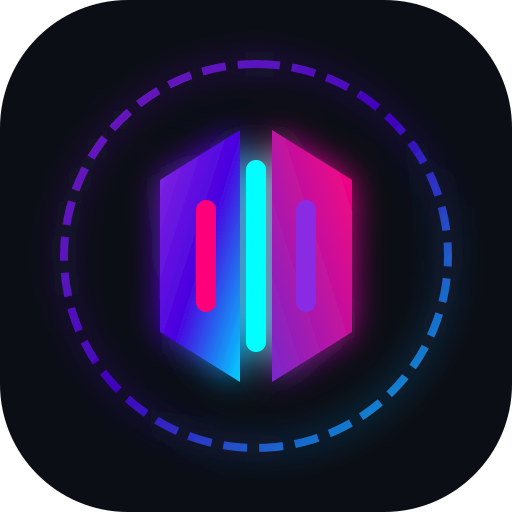

# Musaic Player for Linux

A premium, local-first audiophile music player for Linux desktops — built for people who want a beautiful, distraction-free listening experience with no ads, no trackers, and no cloud dependency.



Musaic Player combines a bit-perfect Linux audio engine with cutting-edge AI features, social LAN listening, and stunning AMOLED and Glassmorphism design aesthetics.

## Key Features

### 🎵 Bit-Perfect Linux Audio Engine
- Direct ALSA hw output bypassing OS mixing and resampling.
- Native C++ DSP engine with 20-band parametric and graphic equalizer.
- Gapless playback with pre-buffering and ReplayGain loudness normalization.
- 7 real-time customizable C++ visualizers (Oscilloscope, Spectrum Analyzer, Vectorscope, and more) with an interactive Scope Rack.
- Native IAMF/Eclipsa spatial audio and Dolby Atmos multichannel decoding.

### 🤖 AI Intelligence Layer (Local-First & Private)
- **AI Romanization & Translation**: Convert Japanese, Korean, Chinese, Cyrillic, Hindi, and Arabic lyrics into readable Latin script or English in real-time. Supports Gemini, OpenAI, Claude, DeepSeek, and local offline **Ollama**.
- **AI Equalizer Assistant**: Type what you want to hear (e.g., *"Warm acoustic guitar with punchy bass and vocal clarity"*), and Musaic automatically crafts the perfect 10-band or 20-band EQ curve for your room and headphones.
- **AI Listening Analytics**: Deep insights into your listening habits, audio bit-depth distributions, and music taste profile.

### 🌌 Music Mood Nebula & Smart Playlists
- An interactive 2D/3D visual canvas mapping your entire local library across Valence and Excitement/Energy coordinates.
- Click any star cluster in the Nebula to instantly generate custom mood-matched Smart Playlists.

### 🎧 Listen Together (Powered by Parallax)
- Sub-millisecond synchronized multi-room LAN playback across multiple Linux, Windows, or Raspberry Pi machines.
- **Collaborative Queue**: Suggest tracks, upvote/downvote next plays, and stream audio directly over your local network without internet streaming services.

### 🎨 Premium Design Themes
- Curated, stunning design themes:
  - **AMOLED Pure Black**: Maximum contrast for OLED displays.
  - **Glassmorphism Backdrop Blur**: Sleek translucent frosted glass aesthetics.
  - **Neon Nebula Glow**: Dynamic vibrant gradients and ambient backdrops.
  - **Material You**: Dynamic color extraction adapting instantly to your currently playing album artwork.

## Development

```bash
# Install dependencies and rebuild native modules
npm install

# Start local development server
npm run dev

# Type check and run tests
npm run typecheck
npm test

# Build Linux AppImage / DEB / RPM package
npm run dist:linux
```
